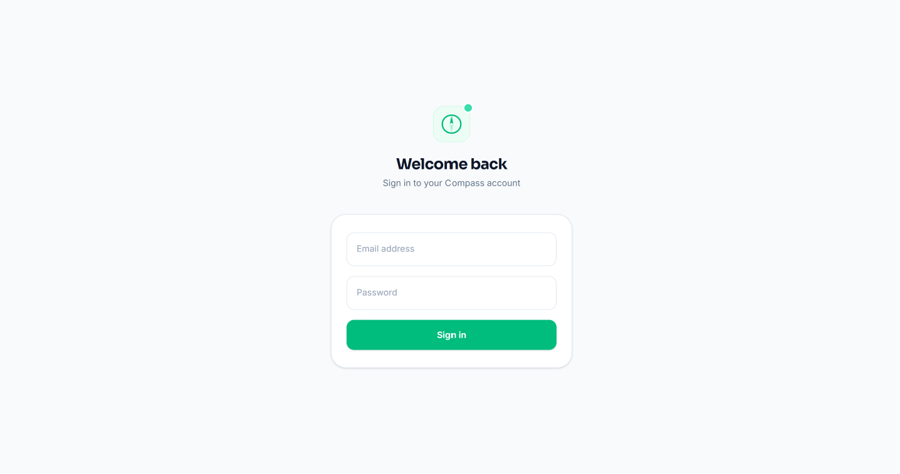
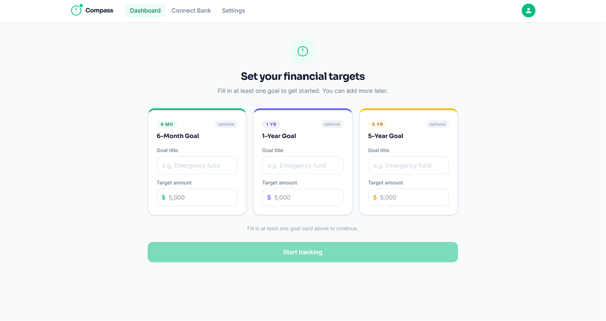
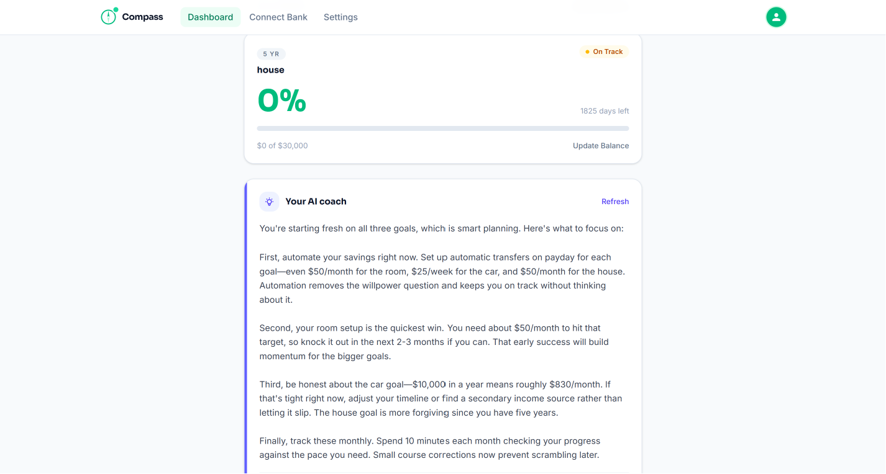
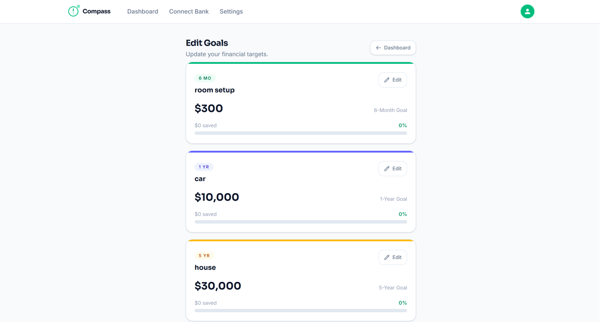
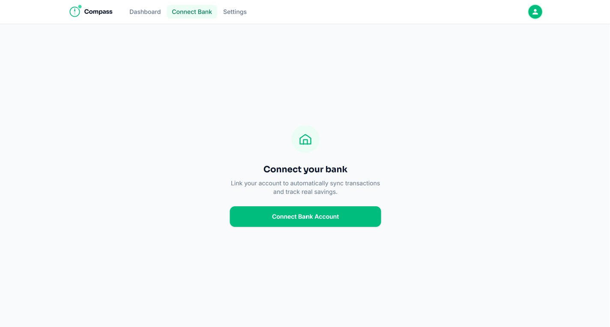
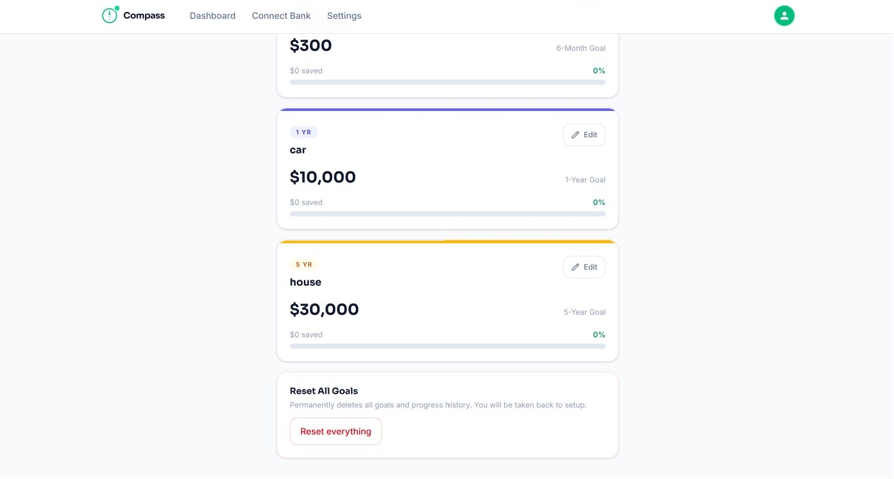
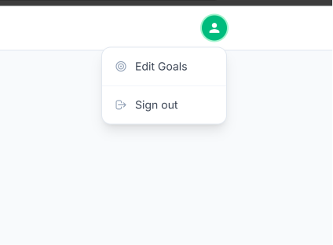

# Compass — AI Financial Co-pilot

Live app: https://compass-phi-one.vercel.app

## Overview

Compass is an AI-powered financial goals tracker that helps users set, track, and hit their money goals faster. Users set 6-month, 1-year, and 5-year savings targets. The app tracks progress in real time, pulls bank transactions via Plaid, and delivers personalized AI coaching via Claude API.

## Screenshots

### Login

### Dashboard

### AI Recommendations

### Edit Goals

### Connect Bank via Plaid

### Reset Goals

### Sign Out

## Features

- Goal setup: set up to 3 savings goals (6-month, 1-year, 5-year) with target amounts
- Live dashboard: real-time progress tracking per goal with pace indicators (Ahead, On Track, Behind)
- AI coach: Claude-powered recommendations tailored to your actual savings pace
- Plaid sandbox integration: auto-pull income and spending to update goal progress
- Edit and reset goals at any time
- Secure authentication via Supabase

## Tech Stack

- Next.js 16 (App Router) + TypeScript
- Tailwind CSS
- Supabase (Postgres + Auth)
- Anthropic Claude API
- Plaid SDK (sandbox)
- Vercel

## Local Setup

1. Clone the repo
2. Run `npm install`
3. Copy `.env.local.example` to `.env.local` and fill in your keys
4. Run SQL migrations in `/supabase/migrations/` via Supabase SQL Editor
5. Run `npm run dev`
6. Open `http://localhost:3000`

## Environment Variables