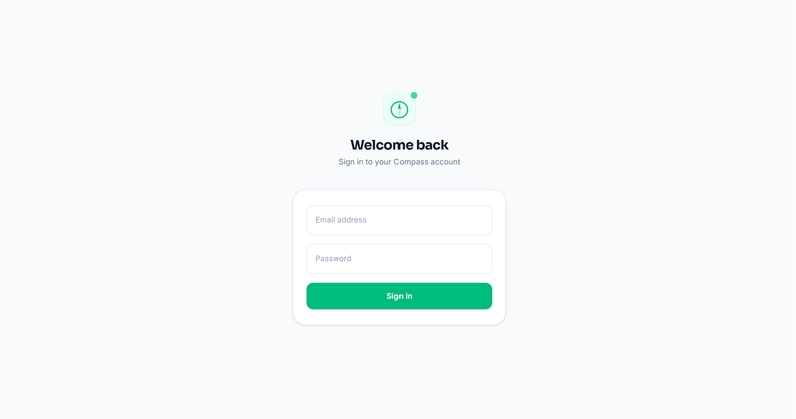
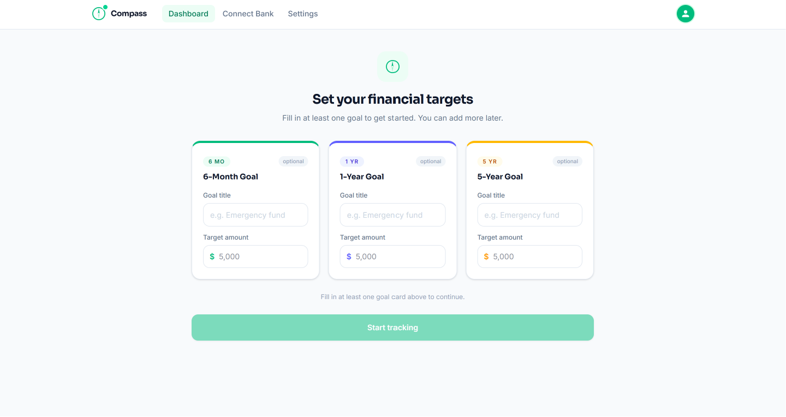
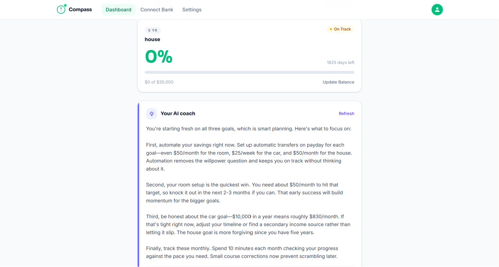
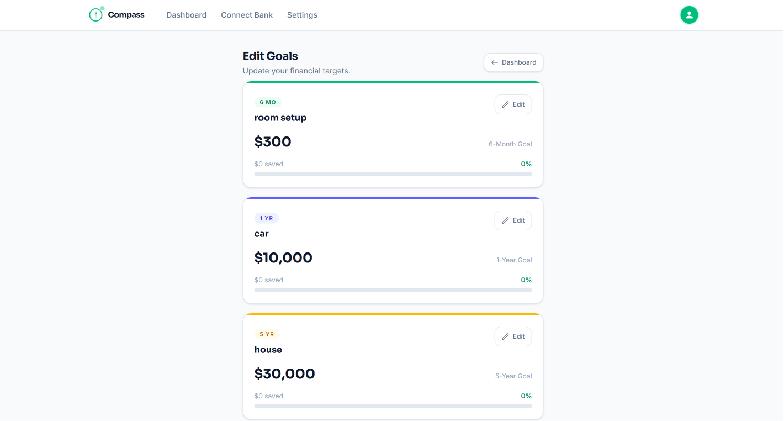
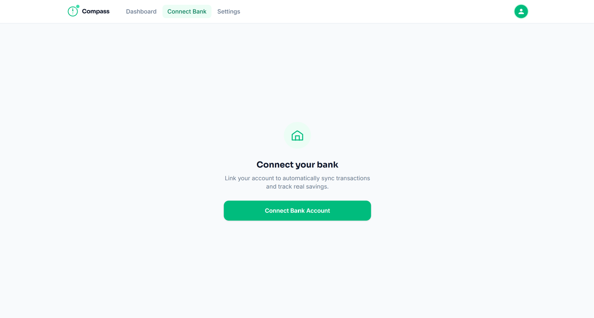
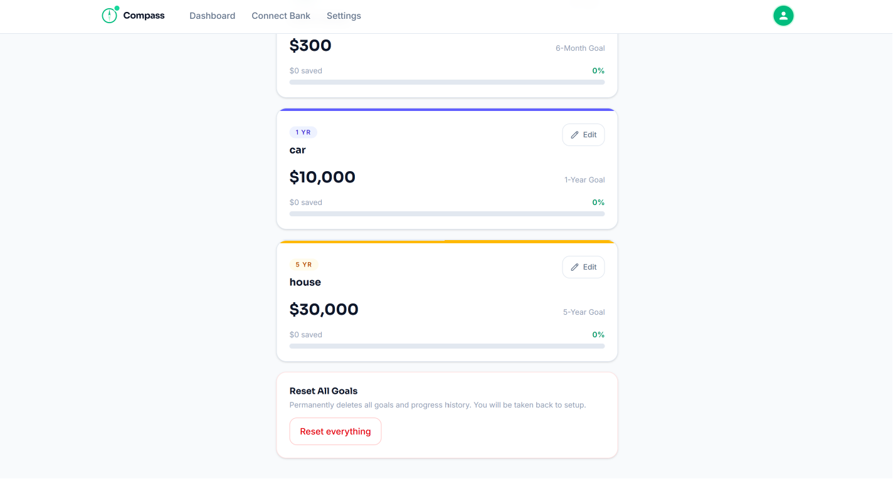
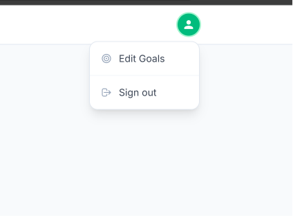

# Compass — AI Financial Co-pilot

Live app: https://compass-phi-one.vercel.app

## Overview

Compass is an AI-powered financial goals tracker that helps users set, track, and hit their money goals faster. Users set 6-month, 1-year, and 5-year savings targets. The app tracks progress in real time, pulls bank transactions via Plaid, and delivers personalized savings tips from a free AI provider with a built-in rule-based fallback.

## Screenshots

### Login

### Dashboard

### AI Recommendations

### Edit Goals

### Connect Bank via Plaid

### Reset Goals

### Sign Out

## Features

- Goal setup: set up to 3 savings goals (6-month, 1-year, 5-year) with target amounts
- Live dashboard: real-time progress tracking per goal with pace indicators (Ahead, On Track, Behind)
- AI coach: tips tailored to your actual savings pace, from a free AI provider (Groq, Gemini or OpenRouter) with a rule-based fallback when AI is off or unavailable
- Plaid sandbox integration: auto-pull income and spending to update goal progress
- Edit and reset goals at any time
- Sign up with email and password, with a confirmation email
- Continue with Google on the login and sign up pages
- Password reset by email (forgot password and reset password pages)
- Session expired handling: if your session ends unexpectedly you are sent to the login page with a clear notice
- Flexible balance entry: add money, withdraw, or set an exact balance, with a live preview of the new balance
- Secure authentication via Supabase

## Tech Stack

- Next.js 16 (App Router) + TypeScript
- Tailwind CSS
- Supabase (Postgres + Auth)
- Free AI providers through one OpenAI-compatible adapter (Groq, Gemini, OpenRouter)
- Plaid SDK (sandbox)
- Vercel

## Local Setup

1. Clone the repo
2. Run `npm install`
3. Copy `.env.local.example` to `.env.local` and fill in your keys
4. Run SQL migrations in `/supabase/migrations/` via Supabase SQL Editor
5. Run `npm run dev`
6. Open `http://localhost:3000`

## Authentication

Authentication uses Supabase Auth on the free plan.

- **Email sign up:** the sign up page collects name, email and password (minimum 8 characters). Supabase sends a confirmation link when email confirmation is on. If it is off, the user goes straight to the dashboard.
- **Google sign in:** enable the Google provider in Supabase (Authentication, Providers) with a free Google Cloud OAuth client. Add your site URL and `/dashboard` to the allowed redirect URLs.
- **Password reset:** the forgot password page emails a link to `/reset-password`, where the user sets a new password and is sent back to the login page.
- **Profiles:** a database trigger (migration `012_handle_new_user.sql`) creates the profile row for every new user, including Google users.
- **Session expiry:** a small watcher redirects to `/login?expired=1` when the session ends unexpectedly. Signing out on purpose does not show the notice.
- **Email limits:** the built-in Supabase email sender is heavily rate limited and may only deliver to your own team addresses. For public sign ups, add a free custom SMTP provider under Authentication, Emails.

## Environment Variables